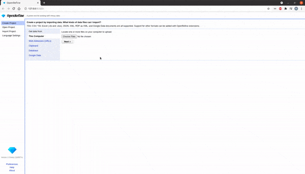
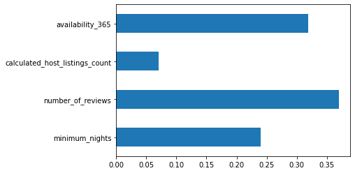

# CMPE255-Data-Cleaning-OpenRefine
Feature engineering and data cleaning exercise using Google OpenRefine

## OpenRefine

## Data Cleaning and Feature Engineering 

1. Data Preparation & Loading
2. Feature Selection
   
   1. ExtraTreesClassifier method
   2. Univariate Selection
3. Data Cleaning: Handling NA values
4. Data Transformation
5. Encoding & Adding new feature
6. Handling Outliers
7. Grouping
8. One Hot Encoding
9.  Split dataset into training and testing
10. Build LinearRegression Model
11. K Fold cross validation to measure accuracy
12. Find best model using GridSearchCV
13. Test model
14. Saving the model
15. Save columns name